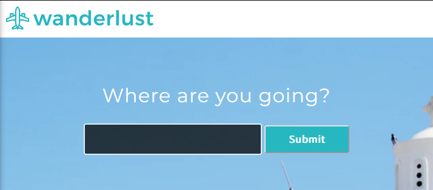

# Description
This project is part of Codecademy's "Full Stack Enginner" course.  
This website will display the current weather and POIs on a user's region of choice through the use of technologic terminology listed below. 

**NOTE:** You will need to get API keys from [OpenWeather](https://home.openweathermap.org) and [FourSquare](https://foursquare.com) to access the website's functionality.  
Do not share your API keys with anyone!

## Technologies
- HTML / CSS
- Javascript (Promises, inbuilt APIs like Fetch, 3rd-Party APIS like OpenWeather and FourSquare, await & async...)
